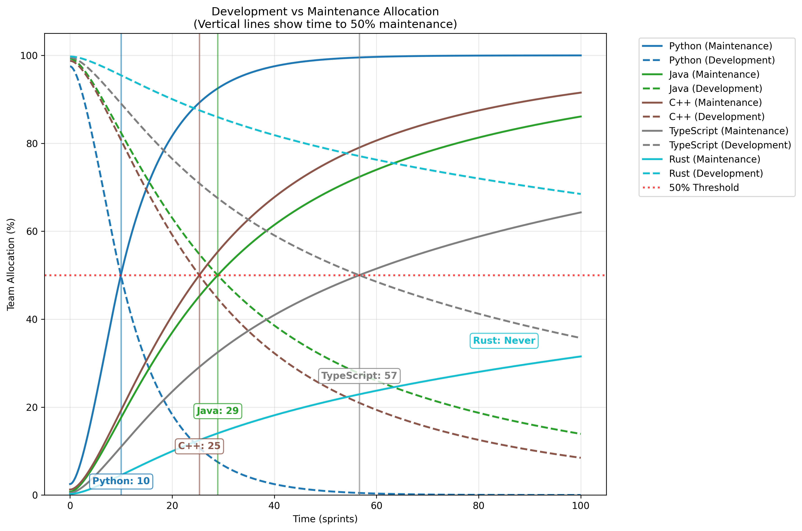
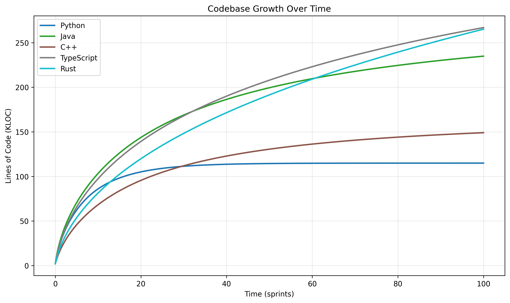
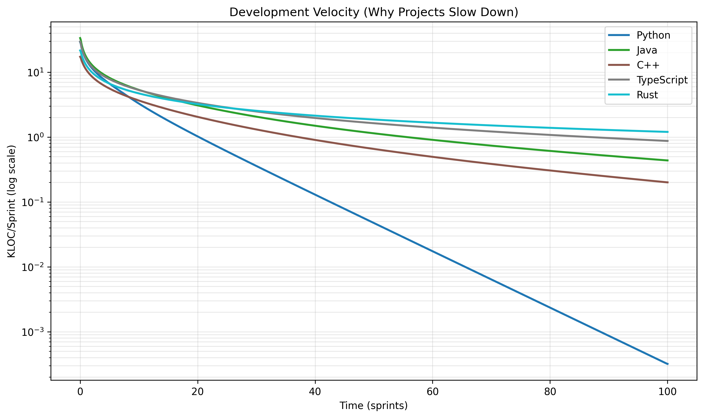
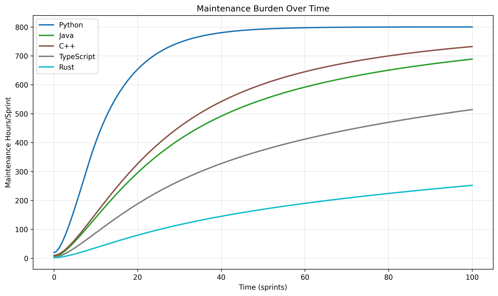
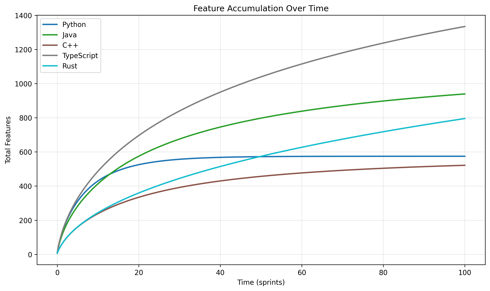

Have you ever wondered why software projects start fast but inevitably 
slow to a crawl? Why adding more developers doesn't always speed things up? 
Why some codebases seem to hit an invisible wall while others sustain 
growth for years?

The answer lies in mathematics—specifically, the same mathematical 
principles that govern population dynamics in ecology. Every software 
project has a **carrying capacity**: a maximum sustainable size determined 
by language choice, team structure, and maintenance practices. Understanding 
this hidden mathematics can transform how we build and scale software.

## The Feature Factory Paradox

Every development team experiences this phenomenon: explosive initial 
growth followed by an inexorable slowdown. Features that once took days 
now require weeks. Simple changes cascade into complex refactors. The 
team works harder but delivers less.

This isn't a failure of process or people—it's **mathematical inevitability**. 
Software development follows the same logistic growth patterns found 
throughout nature, from bacterial colonies to forest ecosystems. The 
difference is that we can measure it, model it, and plan for it.

## The Two Forces: Features vs. Maintenance

At the heart of software dynamics lies a fundamental tension between 
two competing forces:

1. **Feature Development**: Adding new capabilities, building business value
2. **Maintenance Work**: Fixing bugs, refactoring code, managing technical debt

Every developer-hour spent on maintenance is an hour not spent on features. 
But every feature added without proper maintenance creates compound interest 
on technical debt. This creates a mathematical relationship that determines 
your project's ultimate fate.



This visualization shows how different programming languages handle this 
tension over time. Notice the vertical lines—these mark when each language 
reaches the critical 50% maintenance threshold. Python hits this wall in 
just 10 sprints (~5 months), while Rust never reaches it at all.

## The Carrying Capacity of Code

In ecology, carrying capacity represents the maximum population an 
environment can sustain. For software, it's the maximum codebase size 
your team can maintain while still delivering features.

This capacity depends on several factors:

- **Language maintainability**: How much effort each line of code requires over time
- **Development velocity**: How quickly features can be initially implemented  
- **Team structure**: Communication overhead and knowledge distribution
- **Architectural decisions**: Modularity, testing, and documentation practices



The mathematics is surprisingly predictable. Each language reaches a 
natural plateau where maintenance burden balances development capacity. 
Rust sustains the largest codebases (358 KLOC) while Python plateaus 
much earlier (114 KLOC).

## The Mathematics Revealed

I've modeled software development as a system of coupled differential 
equations:

- **L(t)**: Lines of code in thousands (KLOC)
- **M(t)**: Maintenance hours required per sprint

The key insight is that maintenance grows with codebase size, eventually 
consuming all available development time:

```
dL/dt = (development_hours / total_hours) × dev_speed × complexity_factor
dM/dt = (required_maintenance - current_maintenance) × adjustment_rate
```

Where `required_maintenance = L(t) × language.maintenance_burden`

This simple model produces remarkably realistic behavior, capturing the 
exponential slowdown experienced by real development teams.

## Language Design Matters—Mathematically

Different languages have vastly different maintenance characteristics. 
Here's what the data reveals:

- **Python**: 10.0 hours/KLOC/sprint — High maintenance burden due to dynamic nature
- **Java**: 3.0 hours/KLOC/sprint — Enterprise overhead but reasonable maintainability  
- **TypeScript**: 2.0 hours/KLOC/sprint — Type safety provides measurable advantage
- **Rust**: 1.0 hours/KLOC/sprint — Designed for long-term sustainability



The log scale reveals the dramatic differences in velocity decay. Python's 
exponential decline contrasts sharply with Rust's sustained performance. 
This isn't opinion—it's mathematical fact derived from maintenance 
requirements.

## The Maintenance Crisis Timeline

The most striking finding is how quickly projects hit the maintenance wall:

- **Python**: 10 sprints (~5 months) to 50% maintenance
- **C++**: 25 sprints (~1.3 years) to 50% maintenance  
- **Java**: 29 sprints (~1.4 years) to 50% maintenance
- **TypeScript**: 57 sprints (~2.8 years) to 50% maintenance
- **Rust**: Never reaches 50% maintenance



These aren't arbitrary thresholds. At 50% maintenance allocation, teams 
spend more time fixing existing code than building new features. Beyond 
80%, development effectively stops—teams enter "technical bankruptcy."

## Real-World Implications

### For Engineering Managers

**Set realistic expectations.** Your velocity will decline mathematically. 
Plan for it rather than fighting it. Rust codebases can sustain growth 
5x longer than Python codebases—factor this into technology decisions.

**Resource allocation matters.** The model shows optimal maintenance 
allocation varies by language. Fighting the mathematics by forcing 
"features-only" development accelerates the crisis.

### For Developers

**Language choice has compound effects.** That "quick Python prototype" 
may become unmaintainable faster than you think. TypeScript provides 
measurable long-term advantages over JavaScript.

**Write for maintainability from day one.** The maintenance burden you 
create today determines your team's velocity next year.

### For Product Teams

**Velocity naturally declines.** This isn't a team performance issue—it's 
mathematical reality. Plan roadmaps accordingly.

**Innovation requires sustainable pace.** Features delivered quickly but 
unsustainably may actually slow long-term progress.

## Feature Accumulation: The Business Perspective



From a business perspective, what matters is total features delivered. 
TypeScript delivers 1,629 features sustainably, while Python manages 
only 572 before hitting its maintenance ceiling. The "faster" language 
actually delivers less value over time.

## Breaking Through the Limits

While carrying capacity is mathematically inevitable, it's not fixed. 
You can expand your limits through:

**Architectural Innovation**: Microservices, modularization, and clear 
interfaces reduce maintenance burden per line of code.

**Tooling and Automation**: AI-assisted development, comprehensive testing, 
and automated refactoring can shift the maintenance curve.

**Language Evolution**: Modern languages like Rust represent paradigm 
shifts toward sustainability, designed with carrying capacity in mind.

**Strategic Technical Debt Management**: Understanding the mathematical 
model helps optimize the features vs. maintenance trade-off.

## Embracing the Mathematics

Software development is a marathon, not a sprint. The teams and companies 
that understand this mathematics gain a crucial advantage:

- They choose technologies based on long-term sustainability, not short-term speed
- They plan for velocity decline and budget maintenance work accordingly  
- They recognize when projects approach carrying capacity and act proactively
- They measure and model their own development dynamics

## The Model in Practice

Want to analyze your own codebase? The mathematical model is 
[available on GitHub](loc_maint/calc.py) along with all visualizations. 
Key metrics to track:

- **Lines of code growth rate** (dL/dt)
- **Maintenance time percentage** 
- **Feature velocity trends**
- **Time to 50% maintenance threshold**

Understanding the hidden mathematics of software maintenance transforms 
how we think about development. It's not about working harder—it's about 
working within mathematical reality.

Your codebase will reach carrying capacity. The question is: will you be ready?

---

*The complete mathematical model and all visualizations are available in the 
[GitHub repository](https://github.com/meawoppl/meawoppl.github.io/tree/master/_posts/loc_maint). 
The model uses realistic industry data and can be adapted to analyze your 
own projects.*